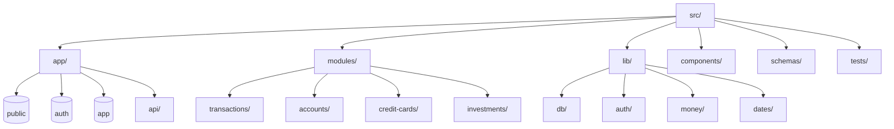
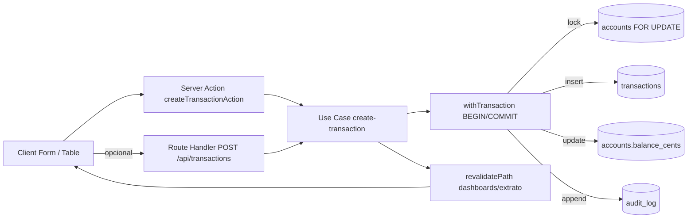

# Design técnico definitivo para PWA web de gestão financeira em Next.js

## Resumo executivo

Este design parte de **premissas “sem restrição específica”** (sem números-alvo de usuários, volume de transações ou SLA definidos) e prioriza **performance de ponta a ponta**: renderização server-first, navegação com **prefetch agressivo**, carregamento progressivo via **streaming/Suspense**, SQL manual altamente otimizado, e uma estratégia de cache segura para dados financeiros (evitando caching indevido em CDNs e Service Worker). As escolhas se apoiam em capacidades atuais do Next.js (App Router, caching/revalidation, prefetch, streaming, Route Handlers, Server Actions). citeturn0search10turn0search4turn2search1turn0search3turn0search25turn0search0

A autenticação é feita via **Clerk** com proteção em Middleware (`clerkMiddleware`) e enforcement no servidor com `auth().protect()` (não confiar no client). citeturn0search5turn0search15

No banco, o padrão base é **PostgreSQL** com **transações explícitas**, **SQL parametrizado**, locks pontuais (`SELECT ... FOR UPDATE`), idempotência com `INSERT ... ON CONFLICT`, e tratamento explícito de isolamento (por padrão `READ COMMITTED`, que é o default do PostgreSQL). citeturn4view0turn0search6turn2search2turn0search13

Checklist conciso de implementação (ordem recomendada):

- Definir o **esqueleto do projeto** (App Router + layouts + rotas) e estabelecer a convenção “Server-first, Client-islands”. citeturn2search28turn0search10  
- Implementar **camada SQL manual** (pool/conexão, timeouts, transações, erro padrão) e **schemas Zod** de entrada/saída. citeturn0search13turn1search0turn1search3  
- Fechar o **modelo de dados mínimo** (contas, lançamentos, cartões/faturas, recorrências, investimentos, auditoria, idempotência) e índices base. citeturn0search6turn2search2  
- Construir o módulo “Lançamentos” (exemplo abaixo) como “template” para os demais: RSC + Server Action + Route Handler + SQL + testes + revalidação. citeturn1search35turn2search1turn0search3  
- Aplicar política de **prefetch** e **streaming** em todas as telas principais. citeturn0search4turn0search10turn0search8  
- Implementar PWA com Service Worker (Workbox), **cache de app shell**, e política conservadora para dados sensíveis. citeturn1search2turn1search5  

## Estrutura de projeto e convenções Server vs Client

A estrutura abaixo é “definitiva” no sentido de: **um padrão unificado** para todos os módulos e telas, com limites claros (UI/RSC vs domínio vs SQL) e pontos únicos de autenticação, logs e transações.

### Tree do projeto com propósito

```txt
src/
  app/
    (public)/                         # rotas públicas (ex.: landing, política de privacidade)
      layout.tsx                      # layout público (server)
      page.tsx

    (auth)/                           # rotas gerenciadas pelo Clerk (páginas de sign-in/up)
      sign-in/[[...sign-in]]/page.tsx
      sign-up/[[...sign-up]]/page.tsx

    (app)/                            # área autenticada (PWA principal)
      layout.tsx                      # shell do app: nav, header, providers mínimos
      loading.tsx                     # skeleton do shell/página (streaming)
      error.tsx                       # boundary de erro (mínimo; sem expor detalhes)

      dashboard/page.tsx              # server component: orquestra dados e blocos
      contas/
        page.tsx
        [accountId]/
          extrato/page.tsx
          extrato/loading.tsx

      lancamentos/page.tsx            # lista consolidada (opcional: por filtros)
      cartoes/
        page.tsx
        [cardId]/page.tsx
      faturas/
        [invoiceId]/page.tsx
      recorrencias/page.tsx
      investimentos/page.tsx
      relatorios/page.tsx

    api/                              # Route Handlers (HTTP explícito)
      webhooks/
        clerk/route.ts                # webhook user.created/user.updated
      transactions/route.ts           # GET list (opcional), POST create
      accounts/route.ts               # POST create (se preferir HTTP)
      exports/
        transactions.csv/route.ts     # exportações (CSV/PDF), sem efeitos colaterais em GET

  components/
    ui/                               # shadcn/ui (muitos são client)
    rsc/                              # componentes server-only puros (sem hooks)
    client/                           # componentes client-only (hooks/estado)
    forms/                            # formulários (client), chamando Server Actions
    layout/                           # nav/header/shell (preferir server + ilhas client pequenas)

  modules/                            # domínio por contexto (DDD-lite)
    accounts/
      application/                    # casos de uso
      domain/                         # regras, invariantes, erros
      infrastructure/                 # SQL/repositories, mappers
      presentation/                   # actions, DTOs, view models
    transactions/
    credit-cards/
    invoices/
    recurrences/
    investments/
    reports/

  lib/
    auth/                             # helpers Clerk: getUserIdOrThrow, roles (se houver)
    db/
      pool.ts                         # pool/conexão, timeouts, tracing
      tx.ts                           # helper withTransaction()
      sql/                            # SQL “source of truth” (strings + builders mínimos)
    errors/                           # AppError, mapeamento p/ HTTP
    money/                            # centavos, arredondamento, formatação
    dates/                            # semântica de datas (competência, liquidação, TZ)
    observability/                    # logs estruturados, métricas, tracing
    env/                              # validação de env com Zod

  schemas/                            # Zod schemas compartilháveis (input/output)
    accounts.schemas.ts
    transactions.schemas.ts
    invoices.schemas.ts
    investments.schemas.ts
    pagination.schemas.ts

  tests/                              # unit + integration + e2e (separado por tipo)
```

Mermaid (visão estrutural do tree):



### Convenções obrigatórias de Server vs Client Components

- **Server Components como default**: todo arquivo `.tsx` é tratado como server até que precise de interatividade. Isso mantém JS no navegador baixo e viabiliza streaming e prefetch eficientes. citeturn0search10  
- Client Components são **ilhas**: use `"use client"` somente em arquivos específicos e pequenos (ex.: filtros, seleção de linhas, formulário RHF).  
- Convenção de nome:  
  - `*.client.tsx` → sempre contém `"use client"`  
  - `*.server.tsx` → opcional para deixar explícito (útil em componentes compartilhados)  
- Regras práticas:
  - Componentes em `components/ui` e `components/forms` tendem a ser client.
  - Componentes em `components/rsc` devem **nunca** usar hooks/client APIs.
- Evitar “clientificar” `layout.tsx` ou árvores grandes: isso destrói a estratégia de performance (hidratação e bundle).  
- Atenção a APIs “dinâmicas” (cookies/headers): usá-las em layout/page força comportamento dinâmico (render em request time). citeturn5search2turn5search21turn3search3  

## Padrões obrigatórios de implementação

### Convenções de código e organização

- TypeScript com `strict` e proibições de `any` em módulos de domínio/infrastrutura.
- “Boundary rule”: **UI não contém SQL**, e SQL não conhece UI. O fluxo é sempre:
  - `app/*` → chama `modules/*/presentation` → chama `application` → chama `infrastructure` (SQL)  
- Padronização de DTOs:
  - **Input** sempre validado com Zod (query params, body, form data). citeturn1search0turn1search3  
  - **Output** também validado/normalizado com Zod (especialmente para `bigint`, datas, nullability).

### Tratamento de erros e contratos de resposta

**Route Handlers (HTTP explícito)**  
- Retornar sempre JSON com envelope:

```ts
type ApiOk<T> = { ok: true; data: T }
type ApiErr = { ok: false; error: { code: string; message: string; details?: unknown } }
```

- Mapear:
  - `ValidationError` → 400
  - `Unauthorized` / `Forbidden` → 401/403
  - `NotFound` → 404
  - `Conflict` → 409
  - `RateLimited` → 429
  - `Unexpected` → 500 (sem detalhes sensíveis)

**Server Actions**  
- Retornar “result object” (não status HTTP), para UI conseguir renderizar estado de erro local.
- Usar `revalidatePath` para atualizar telas afetadas por mutações (ver matriz mais abaixo). `revalidatePath` é suportado em Server Functions e Route Handlers. citeturn0search3turn1search11  

**EffectJS (opcional)**  
- Onde usar: casos de uso com múltiplos passos, dependências e erros estruturados (ex.: “criar lançamento + atualizar saldo + auditoria”). Effect tipa o “canal de erro” e incentiva recuperação/propagação consistente. citeturn1search26turn1search7turn1search1turn1search4  

### Transações, locking e isolamento

- **Mutação que toca mais de uma tabela**: obrigatoriamente dentro de `BEGIN … COMMIT`.
- **Lock pontual**:
  - `SELECT … FOR UPDATE` para linhas que determinam invariantes (saldo de conta, estado de fatura). Em PostgreSQL isso bloqueia as linhas selecionadas contra updates concorrentes. citeturn0search6turn4view0  
- Isolamento:
  - padrão: `READ COMMITTED` (default do PostgreSQL). citeturn4view0  
  - `REPEATABLE READ` / `SERIALIZABLE`: só quando o caso de uso realmente exige consistência de snapshot; implica **retry** em falhas de serialização. citeturn4view0  

### Estilo SQL obrigatório (manual; sem ORM)

- **SQL parametrizado** sempre (nada de concatenação de valores em string). Node-postgres suporta queries parametrizadas e recomenda isso para evitar SQL injection. citeturn0search13  
- Usar `$1, $2, …` para literals; não tentar parametrizar identifiers (colunas/tabelas).  
- Preferir **CTEs** para:
  - “buscar + verificar ownership + devolver” em uma ida ao banco,
  - inserir e retornar campos derivados,
  - manter lógica de “build” de payload no banco (reduz round-trips).
- Idempotência e conflitos:
  - usar `INSERT … ON CONFLICT DO NOTHING/DO UPDATE`. citeturn2search2  
- Prepared statements:
  - considerar preparar statements para queries muito repetidas/complexas (o PostgreSQL descreve que `PREPARE` separa parse/análise do execute e pode evitar trabalho repetido). citeturn0search2  

### Dinheiro e datas (semântica financeira)

**Dinheiro**
- Armazenar valores monetários em **centavos como `bigint`** (`amount_cents bigint not null`), jamais `float`.  
- Invariantes:
  - `amount_cents > 0` em inputs; o “sinal” pertence ao tipo (`EXPENSE/INCOME`) ou ao campo `direction`.
  - Moeda (ex.: `BRL`) explícita quando houver chance de multi-moeda.

**Datas**
- Separar sistematicamente:
  - `occurred_at timestamptz` (quando ocorreu/foi registrado),
  - `competence_date date` (competência contábil para relatórios mensais),
  - `settled_at timestamptz` (quando liquidou em conta).  
- Timezone:
  - armazenar `timestamptz` em UTC e converter na borda (UI) para `America/Sao_Paulo`.

### Auditoria e rastreabilidade

Obrigatório para operações financeiras:
- Tabela `audit_log` append-only contendo:
  - `clerk_user_id`, `actor_type` (user/system), `action`, `entity`, `entity_id`, `before`, `after`, `request_id`, `idempotency_key`, `created_at timetamptz`.
- Cada mutação grava 1 linha de auditoria na mesma transação da mudança principal.

### Idempotência

Para evitar duplicatas em:
- submit duplo (mobile),
- retry automático,
- quedas intermitentes,

padrão obrigatório:
- cada mutação “criar” aceita `client_request_id` (UUID) e possui `UNIQUE (clerk_user_id, client_request_id)`.
- implementar `INSERT … ON CONFLICT …` para retornar o registro existente ao invés de falhar. citeturn2search2turn4view0  

### Segurança com Clerk

- `clerkMiddleware()` para proteger rotas do app e expor estado de auth de forma consistente. citeturn0search5turn0search19  
- Em Server Actions e Route Handlers, chamar `auth().protect()` e obter `userId` no servidor. citeturn0search15  
- Toda query filtra por `clerk_user_id = $1` (ownership).  
- Webhooks do Clerk:
  - usar eventos `user.created/user.updated` para manter `app_users` local sincronizado; o próprio guia de webhooks recomenda sincronizar “só o necessário”. citeturn3search7turn3search11  
  - Observação: Clerk usa entity["company","Svix","webhooks provider"] para envio de webhooks (importa para verificação/assinatura). citeturn3search11  

### Testes, CI/CD, lint/format e budgets

**Testes (mínimo obrigatório)**
- Unit: domínio (cálculos, regras de fatura, classificação de transação).
- Integration: SQL real (queries, locks, transações, índices), incluindo concorrência básica (dois inserts simultâneos).
- E2E: fluxos críticos (criar lançamento, pagar fatura, gerar recorrência).

**CI/CD**
- Pipeline (ex.: entity["company","GitHub","code hosting platform"] Actions):
  - `lint` → `typecheck` → `unit` → `integration` (DB) → `e2e` (smoke) → build/deploy.  
- Deploy sugerido em entity["company","Vercel","cloud platform"]; se usar caching APIs do Next, a plataforma oferece suporte a camadas de cache de dados (ex.: Data Cache) e infraestrutura distribuída (ver doc). citeturn0search21turn2search4  

**Budgets de performance (política)**
- “Performance budgets” (começar simples e cobrar em PR):
  - LCP p75 ≤ 2.5s (mobile em rede mediana)
  - TTFB p75 ≤ 600ms para páginas autenticadas
  - Payload JSON por request ≤ 25KB em telas operacionais (extrato/fatura)
  - Query principal p95 ≤ 50ms; total da tela p95 ≤ 150ms (sem contar rede)
  - Bundle inicial client ≤ 200KB gzip (ilhas only)
- Observabilidade:
  - log estruturado por request (com `request_id`), tempo de query, número de queries, e size do payload.

## Arquitetura de dados por tela

Para orientar as telas, esta seção assume um conjunto mínimo de tabelas (nomes sugestivos):

- `app_users (clerk_user_id pk, created_at, tz, currency)`
- `accounts (id uuid pk, clerk_user_id, name, type, balance_cents bigint, currency, created_at, archived_at)`
- `categories (id uuid pk, clerk_user_id, name, kind, sort_order, archived_at)`
- `transactions (id uuid pk, clerk_user_id, account_id, kind, direction, amount_cents, competence_date, occurred_at, settled_at, category_id, description, notes, merchant, tags text[], status, client_request_id, created_at)`
- `credit_cards (id uuid pk, clerk_user_id, name, closing_day, due_day, limit_cents, created_at, archived_at)`
- `card_purchases (id uuid pk, clerk_user_id, card_id, competence_month date, occurred_at, amount_cents, description, category_id, installment_total, installment_index, created_at)`
- `invoices (id uuid pk, clerk_user_id, card_id, competence_month date, closing_at, due_at, total_cents, status, paid_at, created_at)`
- `recurrences (id uuid pk, clerk_user_id, template_json, frequency, next_run_at, end_at, status)`
- `assets, asset_movements, proceeds (dividends), prices, benchmark_cdi_rates`
- `audit_log (...)`

### Dashboard

**Objetivo de UX/performance**  
A doc de navegação do Next enfatiza prefetch/streaming/transições rápidas; dashboard é o “hub” e deve carregar rápido mesmo com vários blocos. citeturn0search10turn0search8  

**Blocos de dados (carregar por streaming)**  
1) Saldos por conta (top 5 + total)  
2) Próximos vencimentos (recorrências + fatura aberta)  
3) Gastos do mês por categoria (top N)  
4) Resumo cartões (fatura atual e limite)  
5) Patrimônio/investimentos (valor atual + retorno mês)

**SQL (sketch com CTEs)**

- Saldos + total:

```sql
WITH a AS (
  SELECT id, name, type, balance_cents
  FROM accounts
  WHERE clerk_user_id = $1 AND archived_at IS NULL
  ORDER BY name ASC
)
SELECT
  (SELECT json_agg(a) FROM a) AS accounts,
  (SELECT COALESCE(SUM(balance_cents), 0) FROM a) AS total_balance_cents;
```

- Gastos do mês (competência):

```sql
WITH month_tx AS (
  SELECT category_id, SUM(amount_cents) AS spent_cents
  FROM transactions
  WHERE clerk_user_id = $1
    AND direction = 'DEBIT'
    AND competence_date >= date_trunc('month', $2::date)::date
    AND competence_date <  (date_trunc('month', $2::date) + interval '1 month')::date
    AND status = 'POSTED'
  GROUP BY category_id
),
cats AS (
  SELECT c.id, c.name
  FROM categories c
  WHERE c.clerk_user_id = $1 AND c.archived_at IS NULL
)
SELECT
  c.name,
  m.spent_cents
FROM month_tx m
JOIN cats c ON c.id = m.category_id
ORDER BY m.spent_cents DESC
LIMIT 8;
```

**Zod (inputs/outputs)**  
- Input: `month` (YYYY-MM-01), opcional.  
- Output: `accounts[]`, `total_balance_cents`, `topSpending[]`.

**Caching e revalidation**  
- Dashboard é user-specific → **não cachear em CDN**; preferir dados “rápidos” via índices + streaming.  
- Revalidar após mutações com `revalidatePath('/dashboard')`. citeturn0search3turn1search11  

**Paginação**  
- Não aplicável (cards pequenos).  

**Índices recomendados**
- `transactions (clerk_user_id, competence_date, direction, status)` para agregações mensais.
- `accounts (clerk_user_id)`.

**Payload esperado**
- 10–25KB (JSON total), evitando listas longas.

### Contas

**Objetivo**  
Lista de contas + ações rápidas (criar/editar/arquivar) + link para extrato.

**SQL**
- Listagem:

```sql
SELECT id, name, type, balance_cents, currency
FROM accounts
WHERE clerk_user_id = $1 AND archived_at IS NULL
ORDER BY name ASC;
```

**Zod**
- Output: array de contas (id, name, type, balance_cents, currency).

**Caching/revalidation**
- User-specific: sem CDN; após mutações:
  - criar/arquivar conta → `revalidatePath('/contas')` e `revalidatePath('/dashboard')`. citeturn0search3  

**Índices**
- `accounts (clerk_user_id, archived_at)`.

**Payload**
- 2–10KB.

### Lançamentos e Extrato

**Objetivo**  
SSR rápido, paginação por cursor, filtros por período/categoria/texto, e criação de lançamento via Server Action (optimistic UI opcional com idempotência).

**SQL (extrato por conta, cursor-based)**
- Cursor: (`occurred_at`, `id`) para ordenação estável.

```sql
WITH base AS (
  SELECT
    t.id, t.account_id, t.direction, t.amount_cents,
    t.competence_date, t.occurred_at, t.description,
    t.category_id, c.name AS category_name
  FROM transactions t
  LEFT JOIN categories c
    ON c.id = t.category_id AND c.clerk_user_id = $1
  WHERE t.clerk_user_id = $1
    AND t.account_id = $2
    AND t.status = 'POSTED'
    AND t.occurred_at >= $3::timestamptz
    AND t.occurred_at <  $4::timestamptz
    AND (
      $5::timestamptz IS NULL
      OR (t.occurred_at, t.id) < ($5::timestamptz, $6::uuid)
    )
)
SELECT *
FROM base
ORDER BY occurred_at DESC, id DESC
LIMIT $7;
```

**Zod**
- Input (query params): `accountId`, `from`, `to`, `limit`, `cursorOccurredAt?`, `cursorId?`.
- Output: `{ items: TransactionRow[]; nextCursor?: { occurredAt; id } }`.

**Caching/revalidation**
- Tela dinâmica; após criar/editar/excluir lançamento:
  - `revalidatePath('/dashboard')`
  - `revalidatePath('/contas')`
  - `revalidatePath(`/contas/${accountId}/extrato`)` citeturn0search3turn1search11  

**Paginação**
- Cursor obrigatório para performance; evitar `OFFSET` em extratos grandes.

**Índices**
- `transactions (clerk_user_id, account_id, status, occurred_at DESC, id DESC)`
- `transactions (clerk_user_id, competence_date)` (relatórios)
- `categories (clerk_user_id, archived_at)`

**Payload**
- `limit=50`: ~10–25KB (depende de texto/tags).

### Cartões e Faturas

**Objetivo**  
Fatura do mês (itens), parcelas futuras, pagamento de fatura e prevenção de duplicidade de despesa.

**SQL (gerar/consultar fatura atual)**
- Garantir existência de fatura por competência (upsert):

```sql
INSERT INTO invoices (id, clerk_user_id, card_id, competence_month, closing_at, due_at, status, total_cents, created_at)
VALUES ($1, $2, $3, $4::date, $5::timestamptz, $6::timestamptz, 'OPEN', 0, now())
ON CONFLICT (clerk_user_id, card_id, competence_month)
DO UPDATE SET closing_at = excluded.closing_at
RETURNING id;
```

`ON CONFLICT` é o mecanismo explícito do PostgreSQL para tratar violações de unicidade com “DO NOTHING/DO UPDATE”. citeturn2search2  

- Itens da fatura:

```sql
SELECT
  p.id,
  p.occurred_at,
  p.amount_cents,
  p.description,
  p.installment_total,
  p.installment_index,
  c.name AS category_name
FROM card_purchases p
LEFT JOIN categories c ON c.id = p.category_id AND c.clerk_user_id = $1
WHERE p.clerk_user_id = $1
  AND p.card_id = $2
  AND p.competence_month = $3::date
ORDER BY p.occurred_at DESC, p.id DESC
LIMIT $4;
```

**Zod**
- Input: `cardId`, `competenceMonth`, paginação.
- Output: `invoiceSummary`, `items[]`, `totals`.

**Caching/revalidation**
- Sem CDN para dados do usuário.
- Mutações:
  - compra no cartão → revalidar `/faturas/[invoiceId]` + `/dashboard`
  - pagar fatura → revalidar `/dashboard`, `/contas/[accountId]/extrato`, `/faturas/[invoiceId]`

**Índices**
- `invoices (clerk_user_id, card_id, competence_month)` UNIQUE
- `card_purchases (clerk_user_id, card_id, competence_month, occurred_at DESC, id DESC)`

**Payload**
- Itens: 50–100 itens → ~15–40KB.

### Recorrências

**Objetivo**  
Previsibilidade (contas mensais), geração automática e acompanhamento de “previsto vs pago”.

**SQL**
- Listar recorrências ativas:

```sql
SELECT id, frequency, next_run_at, status, template_json
FROM recurrences
WHERE clerk_user_id = $1
  AND status = 'ACTIVE'
ORDER BY next_run_at ASC
LIMIT 200;
```

- “Gerar instâncias” (job): inserir lançamentos cujo `next_run_at <= now()`, dentro de transação, com idempotência (`client_request_id` derivado do recurrenceId + data).

**Caching/revalidation**
- UI: sem CDN.
- Job: ao gerar lançamentos, revalidar `/dashboard` e extratos afetados via `revalidatePath`. citeturn0search3  

**Índices**
- `recurrences (clerk_user_id, status, next_run_at)`

### Investimentos

**Objetivo**  
Separar patrimônio e calcular retorno por:
- valorização do ativo
- CDI (benchmark)  
- proventos

**SQL (posição consolidada por ativo)**
- Exemplo holdings (movimentos):

```sql
WITH m AS (
  SELECT asset_id,
         SUM(CASE WHEN kind IN ('BUY','DEPOSIT') THEN quantity ELSE -quantity END) AS qty
  FROM asset_movements
  WHERE clerk_user_id = $1
  GROUP BY asset_id
),
last_price AS (
  SELECT DISTINCT ON (asset_id)
    asset_id, price_cents, priced_at
  FROM asset_prices
  WHERE priced_at <= now()
  ORDER BY asset_id, priced_at DESC
)
SELECT
  a.id, a.ticker, a.asset_type,
  m.qty,
  lp.price_cents,
  (m.qty * lp.price_cents) AS market_value_cents
FROM assets a
JOIN m ON m.asset_id = a.id
LEFT JOIN last_price lp ON lp.asset_id = a.id
WHERE a.clerk_user_id = $1;
```

**Benchmark CDI**
- CDI é dado “global” (não sensível) → pode ser cacheado com `use cache`/tags em escopos que não dependem de cookies; o Next tem APIs de cache/revalidation para isso. citeturn3search0turn0search25turn0search0  

**Caching/revalidation**
- Holdings do usuário: sem CDN.  
- Séries CDI/cotações: pode usar cache por tempo + `revalidateTag` quando atualizar a série. citeturn0search25turn0search0  

**Índices**
- `asset_movements (clerk_user_id, asset_id)`
- `asset_prices (asset_id, priced_at DESC)`
- `benchmark_cdi_rates (date)` UNIQUE

### Relatórios

**Objetivo**  
Agregações por período (mês/ano), comparativos, exportações.

**SQL (gastos por categoria por mês)**
- Relatório por competência:

```sql
SELECT
  date_trunc('month', competence_date)::date AS month,
  category_id,
  SUM(amount_cents) AS spent_cents
FROM transactions
WHERE clerk_user_id = $1
  AND direction = 'DEBIT'
  AND competence_date >= $2::date
  AND competence_date <  $3::date
  AND status = 'POSTED'
GROUP BY 1, 2
ORDER BY 1 ASC, spent_cents DESC;
```

**Caching/revalidation**
- Para períodos “fechados” (ex.: meses anteriores): pode cachear “por query” com TTL maior, desde que a chave inclua `clerk_user_id` e período e exista política de invalidação por mutação (ou armazenar em tabela de agregados). Se optar por cache de Next/servidor, alinhar com as APIs oficializadas (`use cache`) e invalidação por tag/path. citeturn3search0turn0search25turn0search3turn0search0  

**Índices**
- `transactions (clerk_user_id, competence_date, direction, status)`
- (Opcional) tabela agregada mensal para reduzir custo.

### Matriz de TTL, volatilidade e gatilhos de invalidação

Recomendação conservadora para app financeiro: **não cachear dados sensíveis em caches compartilhados**; quando cachear, preferir “privado” (browser) ou cache de servidor com chaves seguras e invalidação clara. A diretiva `stale-while-revalidate` é útil quando alguma defasagem é aceitável; MDN define que permite servir resposta stale enquanto revalida em background. citeturn5search0turn5search3  

| Conjunto de dados | Volatilidade | TTL sugerido | Onde cachear | Invalidação (gatilhos) |
|---|---|---|---|---|
| Saldos/limites/fatura aberta | Alta | 0–30s | Router cache/prefetch (UX), sem CDN | criar lançamento, pagar fatura, compra cartão |
| Extrato (página atual) | Alta | 0–30s | Router cache/prefetch | criar/editar/excluir lançamento |
| Categorias/metadata contas/cartões | Baixa | 10–60min | servidor (memoização no request + cache opcional) | criar/editar/arquivar categoria/conta/cartão |
| CDI e cotações (globais) | Média | 1–24h | servidor + tags | job atualização CDI/cotações → `revalidateTag` citeturn0search25 |
| Relatórios meses passados | Média/baixa | 1–24h | servidor (ou tabela agregada) | mutação com competência no mês afetado |

### Sugestões de índices base (mínimo)

| Tabela | Índice | Motivo (tela) |
|---|---|---|
| `transactions` | `(clerk_user_id, account_id, status, occurred_at DESC, id DESC)` | extrato rápido por conta (cursor) |
| `transactions` | `(clerk_user_id, competence_date, direction, status)` | dashboard + relatórios mensais |
| `accounts` | `(clerk_user_id, archived_at)` | lista contas |
| `categories` | `(clerk_user_id, archived_at)` | joins em extrato/fatura |
| `invoices` | `UNIQUE (clerk_user_id, card_id, competence_month)` | upsert de fatura |
| `card_purchases` | `(clerk_user_id, card_id, competence_month, occurred_at DESC, id DESC)` | itens da fatura |
| `recurrences` | `(clerk_user_id, status, next_run_at)` | lista + job |

## Módulo exemplo completo: Lançamentos

Escolha: **Lançamentos** porque é o núcleo do sistema (impacta dashboard, extratos, relatórios e recorrências) e é a melhor base para replicar padrões.

### Estrutura do módulo (arquivos)

```txt
src/modules/transactions/
  domain/
    transaction.types.ts              # enums e tipos do domínio
    transaction.errors.ts             # AppError subclasses (Validation, NotFound, Conflict)
  application/
    create-transaction.usecase.ts      # orquestra: valida, tx, lock, insert, update saldo, audit
    list-transactions.usecase.ts
  infrastructure/
    transaction.sql.ts                # SQL statements (strings) e helpers de mapeamento
    transaction.repository.ts          # executa SQL com pool/tx
  presentation/
    transaction.dto.ts                # Zod output schema (DTO público)
    createTransactionAction.ts         # Server Action (form -> usecase)
```

E os pontos de entrada:

```txt
src/app/api/transactions/route.ts      # GET list (opcional), POST create
src/app/(app)/contas/[accountId]/extrato/page.tsx
src/app/(app)/contas/[accountId]/extrato/_components/TransactionTable.client.tsx
src/app/(app)/contas/[accountId]/extrato/_components/CreateTransactionForm.client.tsx
```

### Mermaid: fluxo de dados do módulo



### Schemas Zod (input/output)

Zod é “TypeScript-first” para validação e inferência de tipo via `parse/safeParse`. citeturn1search3turn1search0  

```ts
// src/schemas/transactions.schemas.ts
import { z } from "zod";

export const CreateTransactionInput = z.object({
  accountId: z.string().uuid(),
  direction: z.enum(["DEBIT", "CREDIT"]),
  amountCents: z.number().int().positive(), // normalizar no servidor para bigint depois
  competenceDate: z.string().regex(/^\d{4}-\d{2}-\d{2}$/), // ISO date (YYYY-MM-DD)
  occurredAt: z.string().datetime(), // ISO datetime
  categoryId: z.string().uuid().nullable().optional(),
  description: z.string().min(1).max(140),
  notes: z.string().max(2000).optional(),
  clientRequestId: z.string().uuid(), // idempotência
});

export type CreateTransactionInput = z.infer<typeof CreateTransactionInput>;

export const TransactionRowDTO = z.object({
  id: z.string().uuid(),
  accountId: z.string().uuid(),
  direction: z.enum(["DEBIT", "CREDIT"]),
  amountCents: z.string(), // serializar bigint -> string
  competenceDate: z.string(),
  occurredAt: z.string(),
  description: z.string(),
  category: z.object({
    id: z.string().uuid(),
    name: z.string(),
  }).nullable(),
});

export type TransactionRowDTO = z.infer<typeof TransactionRowDTO>;
```

### SQL completo (create + idempotência + update saldo + audit)

Notas importantes:
- SQL parametrizado (evitar injection). citeturn0search13  
- `SELECT … FOR UPDATE` para proteger atualização de saldo. citeturn0search6turn4view0  
- `ON CONFLICT` para idempotência. citeturn2search2  

```sql
-- 1) Lock e ownership da conta
SELECT id, balance_cents
FROM accounts
WHERE clerk_user_id = $1
  AND id = $2::uuid
  AND archived_at IS NULL
FOR UPDATE;

-- 2) Inserir transação com idempotência por client_request_id
INSERT INTO transactions (
  id, clerk_user_id, account_id,
  direction, amount_cents,
  competence_date, occurred_at,
  category_id, description, notes,
  status, client_request_id, created_at
) VALUES (
  gen_random_uuid(), $1, $2,
  $3, $4::bigint,
  $5::date, $6::timestamptz,
  $7::uuid, $8, $9,
  'POSTED', $10::uuid, now()
)
ON CONFLICT (clerk_user_id, client_request_id)
DO UPDATE SET description = transactions.description
RETURNING id, account_id, direction, amount_cents, competence_date, occurred_at, category_id, description;

-- 3) Atualizar saldo derivado (delta depende da direção)
UPDATE accounts
SET balance_cents = balance_cents + $11::bigint
WHERE clerk_user_id = $1 AND id = $2::uuid;

-- 4) Auditoria append-only
INSERT INTO audit_log (
  id, clerk_user_id, action, entity, entity_id,
  request_id, idempotency_key, before_json, after_json, created_at
) VALUES (
  gen_random_uuid(), $1, 'TRANSACTION_CREATED', 'transaction', $12::uuid,
  $13, $10::uuid, $14::jsonb, $15::jsonb, now()
);
```

### Route Handler (padrão)

Route Handlers são “request handlers” no `app/` e, no Next atual, **não são cacheados por default**; é possível optar por cache em GET via config do segmento. citeturn5search1turn2search1turn2search4  

```ts
// src/app/api/transactions/route.ts
import { auth } from "@clerk/nextjs/server";
import { NextResponse } from "next/server";
import { CreateTransactionInput } from "@/schemas/transactions.schemas";
import { createTransaction } from "@/modules/transactions/application/create-transaction.usecase";

export async function POST(request: Request) {
  const { userId } = auth();
  if (!userId) return NextResponse.json({ ok: false, error: { code: "UNAUTHORIZED", message: "Auth required" } }, { status: 401 });

  const json = await request.json();
  const parsed = CreateTransactionInput.safeParse(json);
  if (!parsed.success) {
    return NextResponse.json(
      { ok: false, error: { code: "VALIDATION_ERROR", message: "Invalid input", details: parsed.error.flatten() } },
      { status: 400 }
    );
  }

  const result = await createTransaction({ clerkUserId: userId, input: parsed.data });

  return NextResponse.json({ ok: true, data: result }, { status: 201 });
}
```

**Observação de segurança**: preferir `auth().protect()` quando quiser enforcement padrão (redirecionamento/erro coerente) conforme docs do Clerk. citeturn0search15  

### Server Action (padrão)

Server Actions executam no servidor e são apropriadas para submissão de formulários (Next tem guia específico para isso). citeturn1search35turn1search23turn1search15  

```ts
// src/modules/transactions/presentation/createTransactionAction.ts
"use server";

import { auth } from "@clerk/nextjs/server";
import { revalidatePath } from "next/cache";
import { CreateTransactionInput } from "@/schemas/transactions.schemas";
import { createTransaction } from "@/modules/transactions/application/create-transaction.usecase";

export async function createTransactionAction(_: unknown, formData: FormData) {
  const { protect, userId } = auth();
  protect();

  const payload = {
    accountId: String(formData.get("accountId")),
    direction: String(formData.get("direction")),
    amountCents: Number(formData.get("amountCents")),
    competenceDate: String(formData.get("competenceDate")),
    occurredAt: String(formData.get("occurredAt")),
    categoryId: formData.get("categoryId") ? String(formData.get("categoryId")) : null,
    description: String(formData.get("description")),
    notes: formData.get("notes") ? String(formData.get("notes")) : undefined,
    clientRequestId: String(formData.get("clientRequestId")),
  };

  const parsed = CreateTransactionInput.safeParse(payload);
  if (!parsed.success) {
    return { ok: false as const, error: { code: "VALIDATION_ERROR", details: parsed.error.flatten() } };
  }

  const dto = await createTransaction({ clerkUserId: userId!, input: parsed.data });

  // Revalidar apenas o que realmente muda
  revalidatePath("/dashboard");
  revalidatePath(`/contas/${parsed.data.accountId}/extrato`);
  revalidatePath("/contas");

  return { ok: true as const, data: dto };
}
```

`revalidatePath` pode ser usado em Server Functions/Actions e Route Handlers. citeturn0search3turn1search11  

### Outline com Effect (opcional)

Objetivo: padronizar “pipeline” com erros tipados + dependências (pool, logger, clock), e facilitar retries/telemetria. A doc do Effect mostra como o tipo `Effect<Success, Error, Requirements>` registra erros esperados no type system e oferece `catchTag/catchAll`. citeturn1search26turn1search7turn1search1  

Pseudo-estrutura:

```ts
// createTransactionEffect: Effect<TransactionDTO, DomainError, Db & Logger>
Effect.gen(function* () {
  const input = yield* validateInput(input);         // DomainError: ValidationError
  const account = yield* lockAccount(accountId);     // DomainError: NotFound/Forbidden
  const tx = yield* insertTransactionIdempotent();   // DomainError: Conflict/DbError
  yield* updateBalance(tx.delta);
  yield* appendAudit();
  return mapToDTO(tx);
}).pipe(
  Effect.catchTags({
    ValidationError: (e) => Effect.fail(e),
    DbError: (e) => Effect.fail(e),
  })
);
```

### Orientação de optimistic UI (com segurança)

- **Permitido** para criar lançamento: se e somente se `clientRequestId` for sempre gerado no client e o backend for idempotente (garantindo que o “submit duplo” não duplica). `ON CONFLICT` dá a base. citeturn2search2  
- UI:
  - inserir linha “pending” na tabela e depois substituir pelo DTO real
  - se falhar, remover a linha pending e mostrar erro normalizado

### Testes (outline)

- Unit:
  - validações de Zod (campos obrigatórios)
  - cálculo de `delta` por direção
- Integration (PostgreSQL real):
  - insert idempotente duplica? (não)
  - concorrência: dois inserts simultâneos atualizam saldo corretamente (lock + update)
  - auditoria: sempre 1 linha por mutação
- E2E:
  - criar lançamento → aparece no extrato e impacta dashboard

### Notas de performance específicas do módulo

- 1 “create”: idealmente 3–4 statements dentro de uma transação; sem round-trips desnecessários.
- Extrato: cursor-based + índice alinhado evita scans longos.
- Evitar “full refresh” do app: revalidar somente paths afetados.

## Guia de navegação, cache, prefetch, revalidação e PWA

### Política de navegação e prefetch

O Next fornece **prefetch embutido** em `<Link />`: prefetch acontece quando o link entra no viewport e é habilitado apenas em produção; se dados prefetched expiram, o Next tenta prefetch novamente no hover. citeturn0search8turn0search1  

Regras obrigatórias:
- Menus principais e cards do dashboard devem usar `<Link prefetch />` (default) para rotas “prováveis”.
- Prefetch manual para rotas “fora do viewport” (ex.: ao carregar dashboard, preaquecer extrato da conta padrão): `router.prefetch()`. citeturn0search4turn0search26  
- Nunca ter efeitos colaterais em `GET` de páginas/API (prefetch faz requests; side effects devem ser POST/Actions). (Isto é crucial para não acionar logout, pagamentos, etc. durante prefetch; o comportamento do Link é por design.) citeturn0search8turn0search12  

### Padrões de streaming, loading e hierarquia de layouts

- Quebrar telas em blocos com `<Suspense>` e `loading.tsx` por segmento, para o usuário ver “estrutura” imediatamente enquanto dados chegam. O guia de navegação do Next destaca streaming/transições para manter navegação responsiva. citeturn0search10  

Mermaid (hierarquia de rotas/layouts):

```mermaid
flowchart TD
  R[/app/] --> PUB[(public)]
  R --> AUTH[(auth)]
  R --> APP[(app)]

  APP --> L1[layout.tsx - shell autenticado]
  L1 --> D[dashboards/page.tsx]
  L1 --> AC[contas/page.tsx]
  AC --> EX[contas/[accountId]/extrato/page.tsx]
  L1 --> CC[cartoes/page.tsx]
  L1 --> INV[investimentos/page.tsx]
  L1 --> REP[relatorios/page.tsx]
```

### Camadas de cache e quando usar

O Next documenta múltiplas camadas de caching e revalidation; em alto nível, rotas dinâmicas não entram no Full Route Cache, mas outros caches podem existir (memoização de request, etc.). citeturn2search4turn3search3turn0search0  

Regras para este app financeiro:
- **Dados do usuário**: assumir sensível → evitar cache compartilhado (CDN). Em respostas HTTP, preferir `Cache-Control: private, no-store` quando for endpoint.  
- **Dados globais** (CDI/cotações): elegíveis a cache por tempo + tags (`revalidateTag`). citeturn0search25turn0search0  
- Cache Components e `use cache`:
  - o Next descreve `use cache` como diretiva para marcar função/componente/rota cacheável e `cacheComponents` como feature opt-in. citeturn3search0turn3search5turn3search2  
  - Para produção, tratar `use cache: private` como **não recomendado** (experimental). citeturn3search8  

### Revalidação e “invalidation matrix” por mutação

Padrão: mutações devem revalidar somente o mínimo necessário, via `revalidatePath` (e `revalidateTag` para caches tagueados). citeturn0search3turn0search25  

| Mutação | Revalidar paths | Revalidar tags (se usadas) |
|---|---|---|
| Criar lançamento em conta | `/dashboard`, `/contas`, `/contas/[id]/extrato` | (opcional) `user:[id]:reports:month` |
| Editar/excluir lançamento | mesmos acima | idem |
| Registrar compra no cartão | `/dashboard`, `/faturas/[id]` | — |
| Pagar fatura | `/dashboard`, `/faturas/[id]`, extrato da conta pagadora | — |
| Gerar recorrências (job) | `/dashboard`, extratos afetados | — |
| Atualizar CDI/cotações (job) | — | `cdi`, `prices` citeturn0search25 |

### Headers HTTP recomendados (quando houver Route Handlers públicos)

- `Cache-Control`:
  - Para JSON sensível: `private, no-store`
  - Para recursos não sensíveis e cacheáveis: combinar `max-age` e `stale-while-revalidate` quando tolerar staleness (MDN descreve que pode servir stale enquanto revalida em background). citeturn5search0turn5search3  
- Definição global via `next.config` `headers()` quando aplicável (doc oficial). citeturn5search17turn5search4  

### Jobs e schedules (recalculation)

Sem “restrição específica”, a estratégia mais segura é:
- **Atualização de CDI/cotações**: job diário (ou intradiário) → atualiza tabelas globais e chama `revalidateTag('cdi')/revalidateTag('prices')`. citeturn0search25  
- **Agregados mensais** (relatórios):  
  - recomputar incrementalmente após mutações (quando o mês afetado é conhecido), ou
  - job noturno que recalcula “mês atual” e “mês anterior” para corrigir drift.

### Estratégia PWA e Service Worker

Como Next.js não “resolve PWA” sozinho, você precisa de Service Worker; Workbox fornece estratégias prontas (Stale-While-Revalidate, NetworkFirst, CacheFirst) e documentação oficial descreve o comportamento e trade-offs. citeturn1search2turn1search8turn1search5  

Política recomendada (financeiro = sensível):
- **Precache** (app shell): HTML shell, CSS, JS chunks, ícones/manifest.
- **Runtime caching**:
  - `CacheFirst` para assets versionados (imagens estáticas, fontes)
  - `StaleWhileRevalidate` para conteúdos não sensíveis (ex.: help/FAQ local, textos públicos)
  - `NetworkFirst` para páginas autenticadas e dados financeiros (para evitar “mostrar saldo velho” offline); permitir fallback mínimo (tela “offline” + último estado local se desejado e autorizado). citeturn1search2turn1search8  
- Evitar cache de respostas de APIs financeiras no SW sem criptografia/consentimento; se implementar leitura offline, tratar como requisito de segurança (PIN/biometria, storage criptografado, etc.) fora do escopo do MVP.

---

Este design atende ao pedido de “produção pronta” ao combinar: padrões de App Router/Route Handlers/Server Actions do Next, prefetch/streaming para UX, proteção e server-side enforcement do Clerk, validação tipada com Zod, SQL manual seguro e performático no PostgreSQL, e uma estratégia de cache conservadora para finanças com revalidação seletiva. citeturn0search10turn5search1turn1search35turn0search5turn4view0turn1search3turn1search2